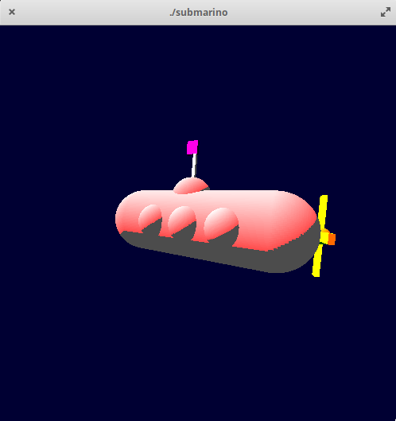

# Submarino Animado com OpenGL - Exemplo de repositório no Git para atividade de Implementação e Modelagem de Software.

## Resumo:

Este repositório contém um projeto que consiste em uma submarino animado utilizando a biblioteca _OpenGL_ e a **linguagem C** para criar formas geométricas, rotações, iluminação e coloração.

## Implementação:
- Click na imagem para ver o vídeo com a solução:
 
[](https://drive.google.com/file/d/173O6s6p6NiTC00Nx8k9IzPpxKxt9HhI5/view?usp=sharing)

## Parte do Código responsável pelas atualizações feitas pelo usuário: 

```
void keyboard (unsigned char key, int x, int y){
   switch (key) {
      case 'd':
         horizontal = (horizontal - 5) % 360;
         glutPostRedisplay();
         break;
      case 'a':
         horizontal = (horizontal + 5) % 360;
         glutPostRedisplay();
         break;
      case 'w':
         vertical = (vertical + 5) % 360;
         glutPostRedisplay();
         break;
      case 's':
         vertical = (vertical - 5) % 360;
         glutPostRedisplay();
         break;
      case 'h':
         helice = (helice - 20) % 360;
         glutPostRedisplay();
         break;
      case 'H':
         helice = (helice + 20) % 360;
         glutPostRedisplay();
         break;
      case 'p':
         periscopio = (periscopio - 5) % 360;
         glutPostRedisplay();
         break; 
      case 'P':
         periscopio = (periscopio + 5) % 360;
         glutPostRedisplay();
         break;
      case 'l':
         periscopio = (periscopio + 5) % 360;
         helice = (helice - 20) % 360;
         horizontal = (horizontal + 5) % 360;
         glutPostRedisplay();
         break;
      case '+':
         if(zoom < 0){
            zoom += 1;
         }
         glutPostRedisplay();
         break;
      case '-':
         if(zoom > -10){
            zoom -= 1;
         }
         glutPostRedisplay();
         break;
      case 27:
         exit(0);
         break;
      default:
         break;
   }
}
```


## Executar o projeto:

- Compilar:
```
gcc -o submarino submarino.c -lglut -lGL -lGLU -lm
```
- executar:

```
./submarino
```
